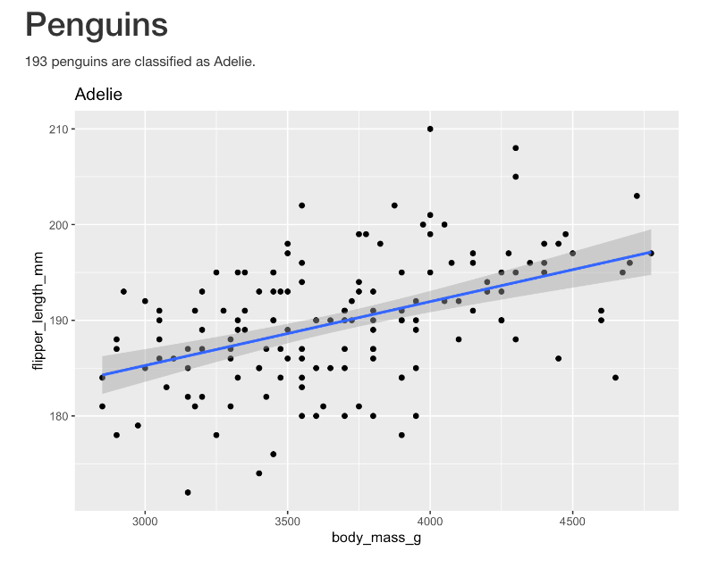

```{r setup, include=FALSE}
options(htmltools.dir.version = FALSE)
episode_counter <- 0
knitr::opts_chunk$set(
  collapse = TRUE,   
  comment = "#>"
)
options(knitr.table.format = "markdown")
```


```{r packages, include=FALSE}
library(countdown)
library(ymlthis)
library(palmerpenguins)
library(tidyverse)
```


class: title-slide, center, middle

<span class="fa-stack fa-4x">
  <i class="fa fa-circle fa-stack-2x" style="color: #ffffffcc;"></i>
  <strong class="fa-stack-1x" style="color:#3b4245;">`r rmarkdown::metadata$session`</strong>
</span> 

# `r rmarkdown::metadata$title`

## `r rmarkdown::metadata$subtitle`

### `r rmarkdown::metadata$author` &#183; RStudio

#### [https://rmd4pharma.netlify.app//](https://https://rmd4pharma.netlify.app//)

---

class: middle, center

# <i class="fas fa-cloud"></i>

# Go here and log in (free):

http://rstd.io/rmd4pharma-cloud

---
class: middle, center, inverse

<span class="fa-stack fa-4x">
  <i class="fa fa-circle fa-stack-2x" style="color: #fff;"></i>
  <strong class="fa-stack-1x" style="color:#2f5275;">`r (episode_counter <- episode_counter + 1)` </strong>
</span> 

--

# Parameters

---
class: left, top

### Knit with Parameters

.tiny[

````
---
title: "Penguins"
output: html_document
params:
  species: Adelie
---

```{r setup, include = FALSE}`r ''`
library(tidyverse) 
smaller <- palmerpenguins::penguins %>% 
  filter(species == params$species,
         !is.na(body_mass_g))
```

# Penguins
`r knitr::inline_expr("nrow(palmerpenguins::penguins) - nrow(smaller)")` penguins are classified as `r knitr::inline_expr("params$species")`.

```{r, echo = FALSE, message = FALSE}`r ''`
smaller %>%
  ggplot(aes(x = body_mass_g, y = flipper_length_mm)) +
  geom_point() +
  geom_smooth(method = "lm") +
  labs(title = params$species)
```

````
]

---




---
class: middle, center, inverse

<span class="fa-stack fa-4x">
  <i class="fa fa-circle fa-stack-2x" style="color: #fff;"></i>
  <strong class="fa-stack-1x" style="color:#2f5275;">`r (episode_counter <- episode_counter + 1)` </strong>
</span> 

--

# Command Line


---
class: left, top

### `rmarkdown::render()`

```{r, eval = FALSE}
library(rmarkdown) # needs to be loaded first
render("rmarkdown-report.Rmd")
```

--

Now that was easy! But why would you want to use `render` rather than just clicking `knit`?

--

How about running a batch of RMDs?  
+ a report  
+ a safety document  
+ a slide deck  
+ or a full website  

--

Run for each drug of interest *all at once*!

---

layout: true

<div class="my-footer"><span>https://rstd.io/rmd4pharma-cloud</span></div>


---
class: top, left

# Render loops

--

```{r}
# the setup
unique_species <- unique(palmerpenguins::penguins$species)
unique_species
```

--

```{r for-loop, eval = FALSE}
# the loop
for(species in unique_species){
  rmarkdown::render(
    "penguin-report.Rmd",
    params = list(species = species)
  )
}
```

#### <i class="fas fa-smoking-ban"></i> psst...the wrong way - but what's wrong?  

--

* What's the name of the output report?

---
class: top, left


### We need two things

For the `rmarkdown::render()` function to work the way we want:  
1. The list of species -> `params` 
2. The name of each report -> `output_file`  

We could do this with a loop, but let's start **purrr**ing...

---
class: middle, center

> "Of course *someone* has to write **loops**.  
> It doesn't have to be *you*.  
> `-` Jenny Bryan

---
class: middle, center


---
class: middle, center


---
class: top, left

### Rendering multiple reports

```{r purrr-render, eval = FALSE}
# the setup
unique_species <- unique(palmerpenguins::penguins$species)

# the function
penguin_render <- function(species){
  rmarkdown::render(
    "penguin-report.Rmd",
    output_file = paste0(species, "-report.html"),
    params = list(species = species)
  )
}

# create the reports
purrr::walk(unique_species, penguin_render)
```


---
class: your-turn

# Your turn

Use this format to create separate site reports for each of the 13 sites in our `mockdata`. Note that there are two main files:  
- `project/analysis/R/parameterized-rmd.R` -- **Skeleton code**  
- `project/analysis/reports/site-report.Rmd` -- **Actual report**  

```{r purrr-render-try, eval = FALSE}
# the setup
unique_species <- unique(palmerpenguins::penguins$species)

# the function
penguin_render <- function(species){
  rmarkdown::render(
    "penguin-report.Rmd",
    output_file = paste0(species, "-report.html"),
    params = list(species = species)
  )
}

# create the reports
purrr::walk(unique_species, penguin_render)
```

---
class: middle, center, inverse

<span class="fa-stack fa-4x">
  <i class="fa fa-circle fa-stack-2x" style="color: #fff;"></i>
  <strong class="fa-stack-1x" style="color:#2f5275;">`r (episode_counter <- episode_counter + 1)` </strong>
</span> 

--

# Reference external R code

---
class: top, left

### Entire .R files

`source()` will allow you to read in entire .R files, and is commonly used to *source* external R functions.

--

### Chunks of .R files

Adding `## ----` and a name to read chunks by name with `knitr::read_chunk()`  

```{r external-r-file,  eval = FALSE}
## ---- smaller-penguins
smaller <- penguins %>%
  filter(
   species == "Adelie",
   !is.na(body_mass_g)
   )
## ---- plot-penguins
smaller %>%
 ggplot(aes(body_mass_g)) +
 geom_histogram(binwidth = 100)
```


---
class: top, left

.pull-left[
### Parent R Markdown

````
---
title: "Penguins"
date: 2020-08-11
output: html_document
---
```{r setup, include = FALSE}`r ''`
library(tidyverse)
library(palmerpenguins)
```
```{r, child=c(“adelie-report.Rmd”)}`r ''`
```

````

]
--

.pull-right[
### Child R Markdown  
`adelie-report.Rmd`  

````
---
output: html_document
---
```{r, echo = FALSE}`r ''`
smaller <- penguins %>%
 filter(species == "Adelie",
 !is.na(body_mass_g))
```
# Penguins
`r knitr::inline_expr("nrow(penguins) - nrow(smaller)")` penguins 
are classified as `r knitr::inline_expr("params$species")`.
```{r, echo = FALSE}`r ''`
smaller %>%
 ggplot(aes(body_mass_g)) +
 geom_histogram(binwidth = 100)
```

````
]


---

## Conditional Child Documents

Add specific chunks if conditions met!

````
---
title: "Drug Safety and Response"
output: html_document
---
```{r setup, include = FALSE}`r ''`
library(tidyverse)
drug_data <- read_csv("drug-data.csv)

pass_fail <- summarize(drug_data, mean = mean(toxicity_param))
```

```{r, child=if (pass_fail >= 1.5) “safe-drug-addendum.Rmd”}`r ''`
```

# Dose Response
```{r}`r ''`
ggplot(drug_data, aes(x = drug_cocn, y = drug_response)) +
 geom_point() +
 geom_smooth()
```


````

---
class: left, top

### Links

+ [Parameterized Reports](https://bookdown.org/yihui/rmarkdown/parameterized-reports.html)  
+ [Parameterized Lesson](https://rmarkdown.rstudio.com/lesson-6.html)  
+ [RMarkdown Cookbook](https://bookdown.org/yihui/rmarkdown-cookbook/)  
+ [RMarkdown Definitive Guide](https://bookdown.org/yihui/rmarkdown/)  

---
class: inverse, middle, center

# Thank you!

